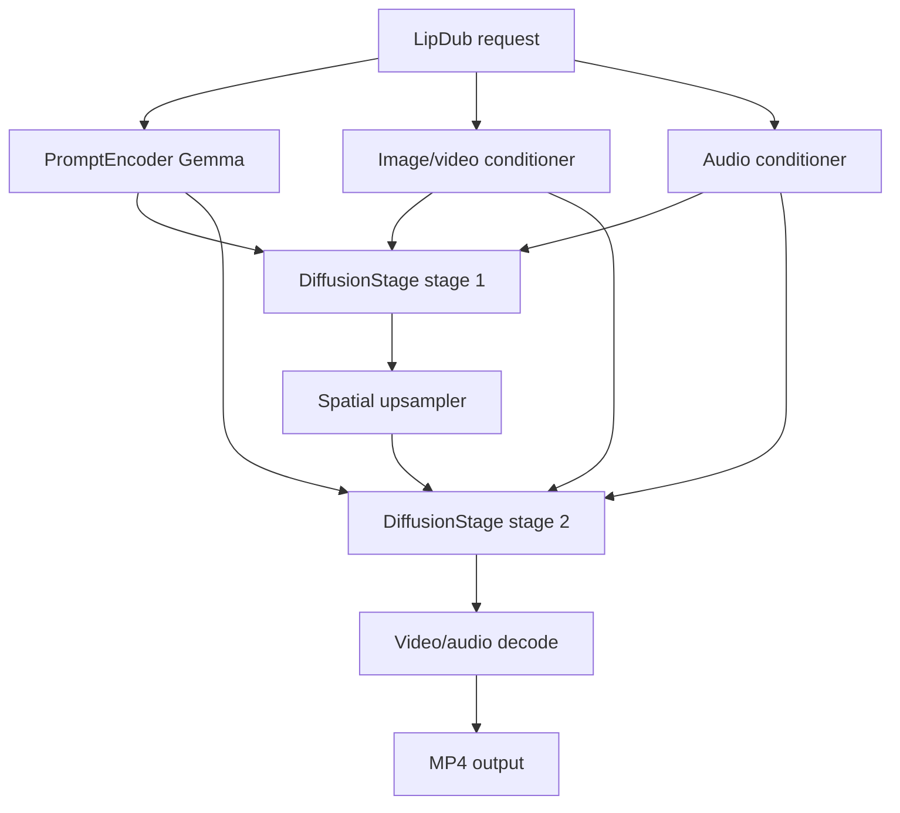
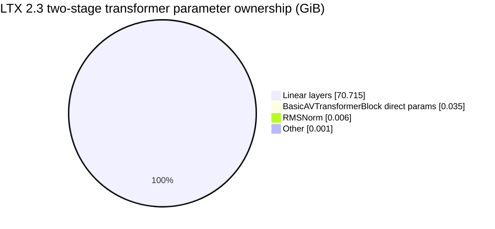
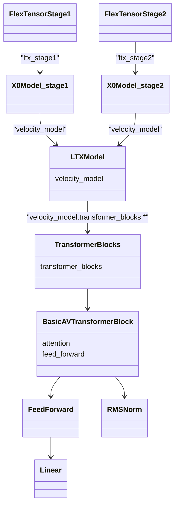
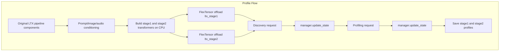
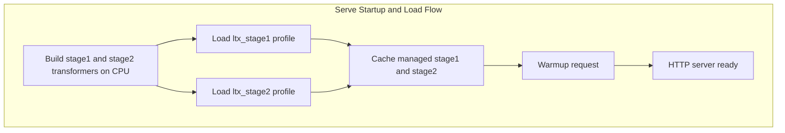
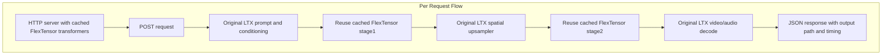

<!--
SPDX-FileCopyrightText: Copyright (c) 2026 NVIDIA CORPORATION & AFFILIATES. All rights reserved.
SPDX-License-Identifier: Apache-2.0
-->
# LTX 2.3 LipDub Pipeline Weight Streaming

This example serves [`Lightricks/LTX-2.3-22b-IC-LoRA-LipDub`](https://huggingface.co/Lightricks/LTX-2.3-22b-IC-LoRA-LipDub) with one FlexTensor manager per LTX diffusion transformer stage used by the official LipDub pipeline, plus an optional manager for the Gemma text encoder.

The example is intended for memory-constrained single-GPU serving experiments, especially A100 40 GB. It separates startup/profile cost from request latency:

- `profile`: builds the LTX transformers (and, with `--offload-text`, the Gemma text encoder) on CPU, wraps each in its own FlexTensor manager, drives discovery/profiling passes, and saves one profile per manager.
- `serve`: loads the profiles, keeps the FlexTensor-managed models resident, and serves local HTTP POST requests.

The example assumes Hugging Face authentication and cache handling are already configured in the environment. It does not include a native/vanilla code path and does not include benchmark artifacts.

## Files

- `serve_infer.py`: FlexTensor-only profile and serving entrypoint.

## Original LTX LipDub Flow

The official `LipDubPipeline` builds several components for one request:

- prompt encoding through Gemma;
- image/video reference conditioning;
- audio reference conditioning;
- diffusion stage 1 at half resolution;
- spatial upsampling;
- diffusion stage 2 at target resolution;
- video and audio decode.

Inside the official pipeline, `DiffusionStage` builds the large LTX transformer on demand. LipDub calls the same `DiffusionStage` twice, so a serving process that keeps both full CUDA transformers resident can leave too little room for request-time decode and activation memory.



## FlexTensor Serving Architecture

This example keeps the original LTX pipeline structure and only changes how the two diffusion transformers are constructed and cached. Image/video conditioning, audio conditioning, spatial upsampling, and video/audio decoding still run through the official LTX pipeline components and are not wrapped by FlexTensor. Gemma prompt encoding also runs through the official component by default, and is only wrapped by FlexTensor when `--offload-text` is passed (see [Optional: Gemma text-encoder offload](#optional-gemma-text-encoder-offload)).

The key serving difference is lifecycle: FlexTensor initialization and profile loading happen once during server startup, not once per request. Requests reuse the cached FlexTensor-managed `stage1` and `stage2` transformers. This is necessary because building both LTX transformers and restoring their FlexTensor profile is expensive; doing it per request would hide the benefit of weight streaming behind startup cost. Keeping the managed transformers resident gives request latency that reflects prompt/conditioning, denoising, upsampling, and decode work rather than model/profile construction.

The example builds both LTX transformer stages on CPU and registers each stage as its own FlexTensor root:

- `ltx_stage1`
- `ltx_stage2`

With `--offload-text`, the Gemma prompt encoder is also offloaded under a third manager:

- `ltx_text`

The two-stage transformer set is about `70.76 GiB` of parameters in BF16. The repeated `Linear` layers own almost all of that weight memory:



The default include pattern targets the stable module path for the repeated transformer blocks, which own almost all of the weight memory:

```text
velocity_model.transformer_blocks.*
```



The example deliberately uses name-based patterns instead of the simpler-looking `class:Linear` / `class:BasicAVTransformerBlock` set. Class patterns match the right parameter-owning modules, but they were too broad during profiling and did not reliably produce the intended per-block layer boundaries in early experiments. The path patterns above line up with the actual `named_modules()` tree under each stage root, producing layer statistics and block assignments for entries such as `velocity_model.transformer_blocks.0` rather than one 35 GiB stage-level block.

The important practical effect is block size. Coarse stage boundaries forced roughly `35 GiB` transfer blocks. The name-based block patterns produced sub-GiB blocks, around `0.6-0.8 GiB` in the A100 runs, which is what makes A100 40 GB serving possible.







The startup flow pays the CPU construction and `offload_from_profile` cost once. The request flow does not call `flextensor.offload()` or `offload_from_profile()` again.

## Optional: Gemma text-encoder offload

By default only the two diffusion stages are offloaded. The official `PromptEncoder` builds the Gemma text encoder on GPU for every request and frees it afterward. On memory-constrained GPUs that transient spike during prompt encoding can be the peak that causes an OOM.

Pass `--offload-text` to also place Gemma under a FlexTensor manager (`ltx_text`). The example patches `PromptEncoder._text_encoder_ctx` to build the encoder on CPU once, wrap it with `flextensor.offload` / `offload_from_profile`, cache it, and reuse it across requests (instead of rebuilding it on GPU each time). The text encoder uses its own aggressive config (small resident footprint at the cost of a slower encode):

- `--text-mem-fraction` (default `0.05`): GPU memory fraction budget for the text manager. Lower it to keep less of Gemma resident (smaller peak, but more streaming and higher encode latency); raise it to keep more resident (faster encode at the cost of memory).
- `--text-include-pattern` (default `model.model.language_model.layers.*`): which Gemma submodules to offload. Override only for a different text-encoder layout.

When enabled, profiling writes a third profile under `text/`, and `serve` loads it alongside the stage profiles.

The effect is to remove the Gemma encode phase as the global memory peak, leaving the diffusion stages as the ceiling. This matters most on A100 40 GB, where removing that spike can be the difference between OOM and completing a request.

## Setup

Start from an NGC PyTorch container with the workspace mounted. The command below is the shape used for dlcluster-style bare-metal Docker sessions:

```bash
mkdir -p /tmp/ltx23-lipdub
docker run -it --gpus all --ipc=host \
  -e CUDA_VISIBLE_DEVICES=0 \
  -e HF_HOME=/workspace/hf \
  -e HUGGINGFACE_HUB_CACHE=/workspace/hf/hub \
  -v /tmp/ltx23-lipdub:/workspace \
  -w /workspace \
  --entrypoint bash \
  nvcr.io/nvidia/pytorch:26.03-py3
```

Clone LTX-2 and install the pipeline packages. The commands below keep the LTX checkout separate from this FlexTensor checkout:

```bash
git clone https://github.com/Lightricks/LTX-2.git /workspace/LTX-2
cd /workspace/LTX-2
uv sync --frozen
```

Install this FlexTensor checkout into the LTX environment:

```bash
cd /workspace/LTX-2
uv pip install --python .venv/bin/python -e /path/to/flextensor
```

The serving script can resolve model files from Hugging Face when authentication/cache is configured. You can either pass local paths or rely on the defaults:

- base checkpoint repo: `Lightricks/LTX-2.3`
- base checkpoint file: `ltx-2.3-22b-distilled-1.1.safetensors`
- spatial upsampler file: `ltx-2.3-spatial-upscaler-x2-1.1.safetensors`
- LipDub LoRA repo: `Lightricks/LTX-2.3-22b-IC-LoRA-LipDub`
- Gemma repo: `google/gemma-3-12b-it-qat-q4_0-unquantized`

## Profile

Create the FlexTensor profile before serving. On A100 40 GB, start with a low memory fraction such as `0.15`:

```bash
cd /workspace
CUDA_VISIBLE_DEVICES=0 /workspace/LTX-2/.venv/bin/python \
  /path/to/flextensor/examples/ltx23/lipdub/serve_infer.py profile \
  --accept-external-licenses \
  --reference-video /workspace/inputs_lipdub_ref_stereo.mp4 \
  --profile-dir /workspace/outputs/ltx23_lipdub_profile \
  --max-gpu-mem-fraction 0.15 \
  --output-path /workspace/outputs/profile_warmup.mp4
```

If your model files are already materialized locally, pass them explicitly:

```bash
  --distilled-checkpoint-path /workspace/models/ltx23/ltx-2.3-22b-distilled-1.1.safetensors \
  --spatial-upsampler-path /workspace/models/ltx23/ltx-2.3-spatial-upscaler-x2-1.1.safetensors \
  --gemma-root /workspace/models/gemma \
  --lora-path /workspace/models/lora/ltx-2.3-22b-ic-lora-lipdub-0.9.safetensors
```

The profile command runs one discovery request and one profiling request by default, then writes:

```text
/workspace/outputs/ltx23_lipdub_profile/stage1/profile.json
/workspace/outputs/ltx23_lipdub_profile/stage2/profile.json
```

With `--offload-text`, a third profile is also written:

```text
/workspace/outputs/ltx23_lipdub_profile/text/profile.json
```

### Profiles are resolution-specific

The block assignment depends on per-layer compute time, which scales with the latent sequence length (and therefore with `--height`/`--width`). Profile at the resolution you intend to serve, and serve with the same dimensions. Reusing a low-resolution profile for high-resolution requests applies the wrong block strategy.

Heights and widths must be multiples of 64. For full HD use `1920x1088` (1080 snaps up to 1088). Example full-HD profile with both DiT and Gemma offload:

```bash
python /path/to/flextensor/examples/ltx23/lipdub/serve_infer.py profile \
  --accept-external-licenses \
  --reference-video /workspace/inputs_lipdub_ref_stereo.mp4 \
  --height 1088 --width 1920 \
  --offload-text --text-mem-fraction 0.05 \
  --max-gpu-mem-fraction 0.30 --profiling-iters 3 \
  --profile-dir /workspace/outputs/ltx23_lipdub_profile_fhd \
  --output-path /workspace/outputs/profile_fhd_warmup.mp4
```

At full HD the per-layer DiT compute far exceeds a block transfer, so transfers hide almost completely and FlexTensor can offload nearly the entire DiT with negligible latency cost. The peak becomes activation-bound rather than weight-bound, so it stays well within an A100 80 GB. Serve full HD by passing the same `--height 1088 --width 1920` and `--profile-dir` to `serve`, and set matching `height`/`width` in each request body.

## Serve

Start the local server from the saved profile:

```bash
cd /workspace
CUDA_VISIBLE_DEVICES=0 /workspace/LTX-2/.venv/bin/python \
  /path/to/flextensor/examples/ltx23/lipdub/serve_infer.py serve \
  --accept-external-licenses \
  --reference-video /workspace/inputs_lipdub_ref_stereo.mp4 \
  --profile-dir /workspace/outputs/ltx23_lipdub_profile \
  --max-gpu-mem-fraction 0.15 \
  --host 127.0.0.1 \
  --port 8020 \
  --warmup-output-path /workspace/outputs/server_warmup.mp4 \
  --output-path /workspace/outputs/server_default.mp4
```

The server performs one warmup generation at startup so model/profile construction is not counted in later request latency.

## Request

Issue a local request:

```bash
curl -sS -X POST http://127.0.0.1:8020 \
  -H 'Content-Type: application/json' \
  -d '{
    "prompt": "a person speaking clearly",
    "reference_video": "/workspace/inputs_lipdub_ref_stereo.mp4",
    "output_path": "/workspace/outputs/request_001.mp4"
  }'
```

The response includes the output path, request wall time, CUDA peak allocation, and before/after GPU memory snapshots.

## A100 40 GB Verification

Use a real A100 40 GB machine for accuracy validation. The fit check alone is not enough: earlier experiments produced successful HTTP responses and media files with matching container metadata, but visual/audio inspection still found FlexTensor-specific corruption.

Allocate or log in to a single-GPU A100 40 GB host using your local cluster workflow. Inside that allocation, run a PyTorch/CUDA environment with one visible GPU and a writable workspace, then make this FlexTensor checkout and the LTX-2 checkout available in that workspace. Keep model caches, outputs, profiles, and review artifacts under your workspace or another durable output directory if the compute-node scratch space is ephemeral.

Use the normalized English golden request from the prior accuracy campaign as the first regression case:

```json
{
  "prompt": "The man is speaking English, saying: \"FlexTensor helps large models run on smaller GPUs by keeping most weights in CPU memory and moving each block to GPU memory right before fast CUDA kernels need it.\"",
  "reference_video": "/workspace/artifacts/runs/2026-06-01/inputs/20260601_183504_normalized.mp4",
  "output_path": "/workspace/outputs/split_manager_a10040/flextensor_normalized_en_alt1_576x320.mp4",
  "height": 320,
  "width": 576,
  "seed": 171198,
  "reference_strength": 1.0
}
```

For each verification run, collect these artifacts:

- native LTX output with the same prompt, reference video, size, seed, and reference strength;
- split-manager FlexTensor output and HTTP response JSON;
- server/profile logs showing `ltx_stage1` and `ltx_stage2`, plus the two profile files;
- `ffprobe` JSON for native and FlexTensor outputs;
- a parameter-equivalence report showing request-visible values match;
- a labeled original/native/FlexTensor comparison video and first-frame image;
- a sonogram or audio-review artifact for FlexTensor output;
- a short inspection note covering video sanity, audio intelligibility, rough lip sync, and whether the known repeated corruption pattern is present.

The reference flow and prior artifacts live in the team-visible `ltx23-lipdub-testing` artifact repository under `runs/2026-06-01`. Treat that flow as the quality bar for this example.

Passing criteria:

- `stage1/profile.json` and `stage2/profile.json` are created and later loaded successfully.
- Warmup and at least one real request complete on A100 40 GB without OOM.
- Native and FlexTensor request-visible parameters match.
- `ffprobe` width, height, duration, frame count, and fps match native within a small tolerance.
- File size and bit rate are close enough to native to avoid the earlier "valid container but corrupted content" failure mode.
- Human visual/audio inspection does not show the known repeated FlexTensor corruption pattern.

## Notes

- The server uses `torch.no_grad()` rather than the official one-shot `torch.inference_mode()` wrapper. Persistent serving reuses cached objects across requests, and inference-mode tensors can fail later with version-counter errors.
- Requests are serialized around the shared pipeline/cache object. The server also validates that each request invokes exactly two diffusion stages, so a future upstream LTX pipeline shape change fails loudly instead of silently reusing the wrong cached stage.

## External Artifacts and Licenses

The default model artifacts are listed in [`EXTERNAL_MATERIALS.md`](../../../EXTERNAL_MATERIALS.md). These artifacts are not distributed with FlexTensor and are governed by their upstream terms. In particular, LTX artifacts are governed by the [LTX-2 Community License Agreement](https://huggingface.co/Lightricks/LTX-2.3/raw/main/LICENSE), which includes commercial-use and acceptable-use restrictions. Review and comply with the applicable upstream terms before downloading or running the default artifacts.

If any default repository is unavailable or unsuitable for your use case, replace it with CLI flags: `--distilled-checkpoint-repo`, `--spatial-upsampler-repo`, `--gemma-repo`, and `--lora-repo` select alternate Hugging Face repositories, while `--distilled-checkpoint-path`, `--spatial-upsampler-path`, `--gemma-root`, and `--lora-path` use local artifacts directly.

Related upstream references:

- [LTX-2.3 base model](https://huggingface.co/Lightricks/LTX-2.3)
- [LTX-2.3 LipDub IC-LoRA](https://huggingface.co/Lightricks/LTX-2.3-22b-IC-LoRA-LipDub)
- [Gemma text encoder](https://huggingface.co/google/gemma-3-12b-it-qat-q4_0-unquantized)
- [Official `LipDubPipeline` source](https://github.com/Lightricks/LTX-2/blob/main/packages/ltx-pipelines/src/ltx_pipelines/lipdub.py)
