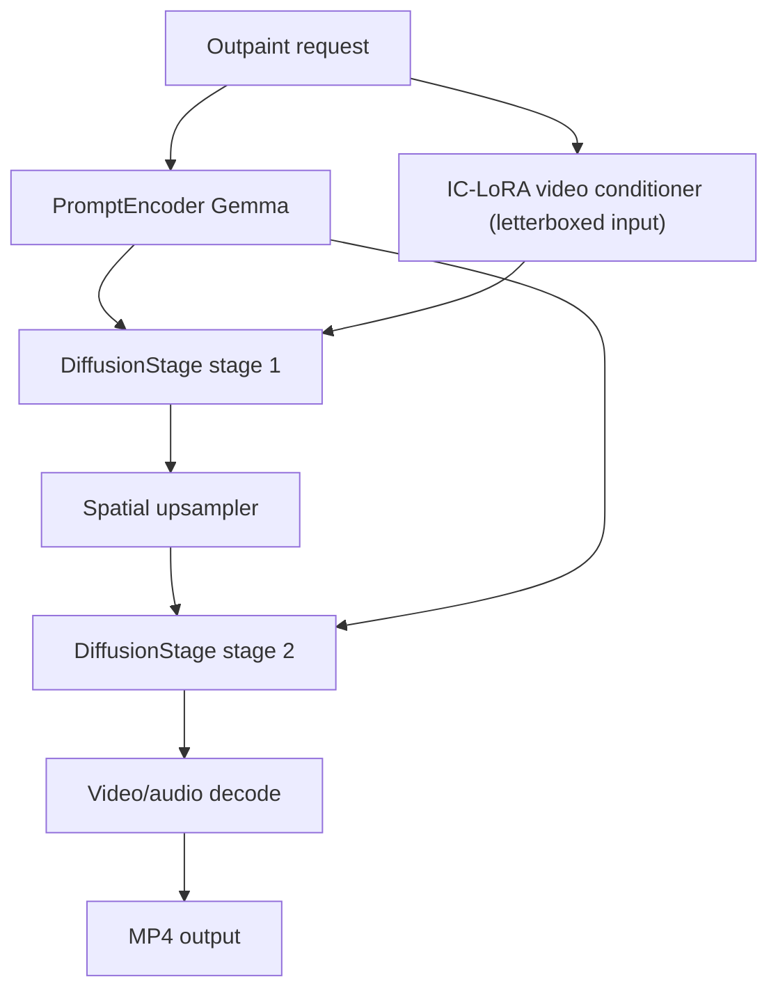
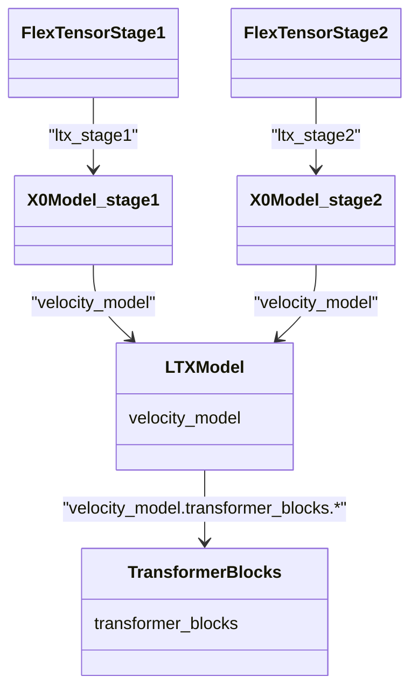

<!--
SPDX-FileCopyrightText: Copyright (c) 2026 NVIDIA CORPORATION & AFFILIATES. All rights reserved.
SPDX-License-Identifier: Apache-2.0
-->
# LTX 2.3 Outpaint IC-LoRA Pipeline Weight Streaming

This example serves the [`oumoumad/LTX-2.3-22b-IC-LoRA-Outpaint`](https://huggingface.co/oumoumad/LTX-2.3-22b-IC-LoRA-Outpaint) IC-LoRA on top of the official two-stage `ICLoraPipeline`, with one FlexTensor manager per LTX diffusion transformer stage, plus an optional manager for the Gemma text encoder.

The Outpaint IC-LoRA extends the canvas of an input video: you letterbox the source to the target canvas with pure-black bars in the regions you want to fill, and the model paints those regions with content that is visually and temporally consistent with the original footage. It exercises FlexTensor on the default LTX-2.3 two-stage (latent upscaling) path.

The example supports memory-constrained single-GPU serving and Ulysses context parallelism across 2, 4, or 8 GPUs. It separates startup/profile cost from request latency:

- `profile`: builds the LTX transformers (and, with `--offload-text`, the Gemma text encoder) on CPU, wraps each in its own FlexTensor manager, drives discovery/profiling passes, and saves one profile per manager.
- `serve`: loads the profiles, keeps the FlexTensor-managed models resident, and serves local HTTP POST requests.

The example assumes Hugging Face authentication and cache handling are already configured in the environment. It does not include a native/vanilla code path and does not include benchmark artifacts.

The default model artifacts are listed in [`EXTERNAL_MATERIALS.md`](../../../EXTERNAL_MATERIALS.md). These artifacts are not distributed with FlexTensor and are governed by their upstream terms. In particular, LTX artifacts are governed by the [LTX-2 Community License Agreement](https://huggingface.co/Lightricks/LTX-2.3/raw/main/LICENSE), which includes commercial-use and acceptable-use restrictions. Review and comply with the applicable upstream terms before downloading or running the default artifacts.

If any default repository is unavailable or unsuitable for your use case, replace it with CLI flags: `--distilled-checkpoint-repo`, `--spatial-upsampler-repo`, `--gemma-repo`, and `--lora-repo` select alternate Hugging Face repositories, while `--distilled-checkpoint-path`, `--spatial-upsampler-path`, `--gemma-root`, and `--lora-path` use local artifacts directly.

Related upstream references:

- [LTX-2.3 base model](https://huggingface.co/Lightricks/LTX-2.3)
- [LTX-2.3 Outpaint IC-LoRA](https://huggingface.co/oumoumad/LTX-2.3-22b-IC-LoRA-Outpaint)
- [Gemma text encoder](https://huggingface.co/google/gemma-3-12b-it-qat-q4_0-unquantized)
- [Official `ICLoraPipeline` source](https://github.com/Lightricks/LTX-2/blob/main/packages/ltx-pipelines/src/ltx_pipelines/ic_lora.py)

## Files

- `serve_infer.py`: FlexTensor-only profile and serving entrypoint.
- `context_parallel.py`: world-group Ulysses attention and distributed request coordination helpers.
- `single_serve.sh`: CP1/single-GPU serving helper for an existing FlexTensor profile.
- `nginx_serve.sh`: single-node DP/CP replica launcher and NGINX front end for an existing profile.
- `setup.sh`: environment setup helper for the LTX-2 checkout and FlexTensor install.
- `letterbox.py`: helper to pad a source video onto the target canvas with pure-black bars.

## How outpaint works

The IC-LoRA was trained with pure black pixels (RGB 0,0,0) as the sentinel for the region to generate. At inference you letterbox the source video to the target canvas with black bars on the sides / top / bottom you want to extend, and the model fills those regions. This example takes an already-letterboxed conditioning video and passes it to the pipeline as the IC-LoRA `video_conditioning`.

### Preparing the letterboxed input

Use `letterbox.py` to pad a raw source video onto the target canvas without rescaling the original content (the source frames are placed verbatim; the extension regions are filled with exact black). Specify either per-side margins or an explicit canvas:

```bash
# Margin mode: add 320 px of black on the left and right (extend horizontally).
/workspace/LTX-2/.venv/bin/python \
  /path/to/flextensor/examples/ltx23/outpaint/letterbox.py \
  --input /workspace/inputs/source.mp4 \
  --output /workspace/inputs/letterboxed_720p.mp4 \
  --left 320 --right 320

# Canvas mode: place the source centered on an explicit 1280x704 canvas.
/workspace/LTX-2/.venv/bin/python \
  /path/to/flextensor/examples/ltx23/outpaint/letterbox.py \
  --input /workspace/inputs/source.mp4 \
  --output /workspace/inputs/letterboxed_720p.mp4 \
  --width 1280 --height 704
```

The resulting canvas must be a multiple of 64 (e.g. `1280x704` for 720p); `letterbox.py` fails fast otherwise (use `--no-validate` to downgrade to a warning). Pass the same dimensions as `--height`/`--width` to `profile`/`serve`. The dark-scene gamma round-trip is handled separately by `serve_infer.py` (`--gamma`).

### Optional dark-scene gamma round-trip

Because pure black is the "generate here" signal, very dark source footage can be ambiguous and the bars may be left un-generated. The fix is a gamma round-trip, available via `--gamma` (default `1.0` = disabled, `2.0` matches the model card):

- Before generation, the letterboxed input is brightened with a per-channel RGB gamma (`out = (in/255) ** (1/g) * 255`, via ffmpeg `lutrgb`). Real dark content lifts into clearly-colored territory while the pure-black bars stay pure black (0 is an exact fixed point of the curve).
- After generation, the output is darkened by the exact inverse (gamma `1/g`) so the whole frame returns to the original exposure.

This matches the author's ComfyUI `Color Correct (mtb)` node, which also works in full-range RGB. The curve is exactly invertible, so the round-trip is lossless on continuous values (8-bit only adds <=~4/255 quantization), and the forward pass is encoded losslessly to keep the bars pure black. Note we deliberately do **not** use ffmpeg's `eq=gamma`: `eq` operates on limited-range luma (black is `Y=16`), so brightening lifts the bars to ~56/255 in the file the model consumes, destroying the "generate here" sentinel. For pixel-exact bars on heavily compressed sources, prefer preparing a brightened, letterboxed input yourself and leaving `--gamma` at `1.0`.

## Original LTX IC-LoRA flow

The official `ICLoraPipeline` builds several components for one request:

- prompt encoding through Gemma;
- image/video conditioning (here: the letterboxed reference video, via IC-LoRA);
- diffusion stage 1 at half resolution;
- spatial upsampling;
- diffusion stage 2 at target resolution;
- video and audio decode.

Inside the official pipeline, each `DiffusionStage` builds the large LTX transformer on demand. The pipeline runs two distinct stages (`stage_1`, `stage_2`), so a serving process that keeps both full CUDA transformers resident can leave too little room for request-time decode and activation memory.



## FlexTensor Serving Architecture

This example keeps the original LTX pipeline structure and only changes how the two diffusion transformers are constructed and cached. IC-LoRA video conditioning, spatial upsampling, and video/audio decoding still run through the official LTX pipeline components and are not wrapped by FlexTensor. Gemma prompt encoding also runs through the official component by default, and is only wrapped by FlexTensor when `--offload-text` is passed (see [Optional: Gemma text-encoder offload](#optional-gemma-text-encoder-offload)).

The key serving difference is lifecycle: FlexTensor initialization and profile loading happen once during server startup, not once per request. Requests reuse the cached FlexTensor-managed `stage1` and `stage2` transformers. Building both LTX transformers and restoring their FlexTensor profile is expensive; doing it per request would hide the benefit of weight streaming behind startup cost. Keeping the managed transformers resident gives request latency that reflects prompt/conditioning, denoising, upsampling, and decode work rather than model/profile construction.

The example builds both LTX transformer stages on CPU and registers each stage as its own FlexTensor root:

- `ltx_stage1`
- `ltx_stage2`

With `--offload-text`, the Gemma prompt encoder is also offloaded under a third manager:

- `ltx_text`

The default include pattern targets the stable module path for the repeated transformer blocks, which own almost all of the weight memory:

```text
velocity_model.transformer_blocks.*
```



The example deliberately uses name-based patterns instead of `class:Linear` / `class:BasicAVTransformerBlock`. Class patterns match the right parameter-owning modules, but they were too broad during profiling and did not reliably produce the intended per-block layer boundaries. The path pattern above lines up with the actual `named_modules()` tree under each stage root, producing layer statistics and per-block assignments (e.g. `velocity_model.transformer_blocks.0`) rather than one stage-level block. The practical effect is block size: coarse stage boundaries force a single huge transfer block, while the name-based pattern produces sub-GiB blocks that can be streamed under a tight memory budget.

```mermaid
flowchart TD
    subgraph requestFlow [Per Request Flow]
        server["HTTP server with cached FlexTensor transformers"] --> request["POST request"]
        request --> gammaIn["Optional gamma 2.0 on letterboxed input"]
        gammaIn --> prompt3["Original LTX prompt and IC-LoRA conditioning"]
        prompt3 --> stage1["Reuse cached FlexTensor stage1"]
        stage1 --> upsample2["Original LTX spatial upsampler"]
        upsample2 --> stage2["Reuse cached FlexTensor stage2"]
        stage2 --> decode["Original LTX video/audio decode"]
        decode --> gammaOut["Optional inverse gamma 0.5 on output"]
        gammaOut --> response["JSON response with output path and timing"]
    end
```



The startup flow pays the CPU construction and `offload_from_profile` cost once. The request flow does not call `flextensor.offload()` or `offload_from_profile()` again.

## Optional: Gemma text-encoder offload

By default only the two diffusion stages are offloaded. The official `PromptEncoder` builds the Gemma text encoder on GPU for every request and frees it afterward. On memory-constrained GPUs that transient spike during prompt encoding can be the peak that causes an OOM.

Pass `--offload-text` to also place Gemma under a FlexTensor manager (`ltx_text`). The example patches `PromptEncoder._text_encoder_ctx` to build the encoder on CPU once, wrap it with `flextensor.offload` / `offload_from_profile`, cache it, and reuse it across requests (instead of rebuilding it on GPU each time). The text encoder uses its own aggressive config (small resident footprint at the cost of a slower encode):

- `--text-mem-fraction` (default `0.05`): GPU memory fraction budget for the text manager. Lower it to keep less of Gemma resident (smaller peak, but more streaming and higher encode latency); raise it to keep more resident (faster encode at the cost of memory).
- `--text-include-pattern` (default `model.model.language_model.layers.*`): which Gemma submodules to offload. Override only for a different text-encoder layout.

When enabled, profiling writes a third profile under `text/`, and `serve` loads it alongside the stage profiles. The shell helpers enable text offload by default (`OFFLOAD_TEXT=1`) because the 40 GB path otherwise OOMs while rebuilding Gemma during profile or serve. Set `OFFLOAD_TEXT=0` only when you have enough GPU headroom or want to compare the non-text-offloaded path.

## Setup

Start from an NGC PyTorch container with the workspace mounted:

```bash
mkdir -p /tmp/ltx23-outpaint
docker run -it --gpus all --ipc=host \
  -e CUDA_VISIBLE_DEVICES=0 \
  -e HF_HOME=/workspace/hf \
  -e HUGGINGFACE_HUB_CACHE=/workspace/hf/hub \
  -v /tmp/ltx23-outpaint:/workspace \
  -w /workspace \
  --entrypoint bash \
  nvcr.io/nvidia/pytorch:26.03-py3
```

Clone LTX-2 and install the pipeline packages, then install this FlexTensor checkout into the LTX environment:

```bash
git clone https://github.com/Lightricks/LTX-2.git /workspace/LTX-2
cd /workspace/LTX-2
uv sync --frozen
uv pip install --python .venv/bin/python -e /path/to/flextensor
```

The serving script resolves model files from Hugging Face when authentication/cache is configured, or you can pass local paths:

- base checkpoint repo: `Lightricks/LTX-2.3`
- base checkpoint file: `ltx-2.3-22b-distilled-1.1.safetensors`
- spatial upsampler file: `ltx-2.3-spatial-upscaler-x2-1.1.safetensors`
- Outpaint LoRA repo: `oumoumad/LTX-2.3-22b-IC-LoRA-Outpaint`
- Outpaint LoRA file: `ltx-2.3-22b-ic-lora-outpaint.safetensors`
- Gemma repo: `google/gemma-3-12b-it-qat-q4_0-unquantized`

The Gemma repo is gated. Request access on Hugging Face and export
`HF_TOKEN` before running `setup.sh`; the helper fails fast when it is missing.
Because `setup.sh` downloads external model snapshots, it also requires
`ACCEPT_EXTERNAL_LICENSES=1` after you have reviewed the upstream terms.

## Profile

Create the FlexTensor profile before serving. Use the same request shape and CP
size for profiling and serving:

- `height` and `width` must be multiples of 64. For 720p, use `1280x704`
  because 720 snaps to 704.
- `num_frames` must be a positive integer of the form `8*k + 1`, for example
  `1`, `9`, `17`, `49`, or `449`. This applies to `--num-frames`, the
  `NUM_FRAMES` shell variable, and request JSON.
- The CP size, set with `--context-parallel-size` or `CONTEXT_PARALLEL_SIZE`,
  must be `1`, `2`, `4`, or `8`. CP3 and other values are rejected at startup.

On A100 40 GB, start with a low memory fraction such as `0.15`:

```bash
/workspace/LTX-2/.venv/bin/python \
  /path/to/flextensor/examples/ltx23/outpaint/serve_infer.py profile \
  --accept-external-licenses \
  --conditioning-video /workspace/inputs/letterboxed_720p.mp4 \
  --height 704 --width 1280 \
  --profile-dir /workspace/outputs/ltx23_outpaint_profile \
  --max-gpu-mem-fraction 0.15 \
  --output-path /workspace/outputs/profile_warmup.mp4
```

For CP2, CP4, or CP8, create a separate profile with a matching `torchrun` world size. For example, CP4:

```bash
TORCH_NCCL_ASYNC_ERROR_HANDLING=1 \
CUDA_VISIBLE_DEVICES=0,1,2,3 \
/workspace/LTX-2/.venv/bin/torchrun --standalone --nproc-per-node=4 \
  /path/to/flextensor/examples/ltx23/outpaint/serve_infer.py profile \
  --accept-external-licenses \
  --context-parallel-size 4 \
  --conditioning-video /workspace/inputs/letterboxed_720p.mp4 \
  --num-frames 449 --frame-rate 15 \
  --height 704 --width 1280 \
  --profile-dir /workspace/outputs/ltx23_outpaint_profile_cp4 \
  --max-gpu-mem-fraction 0.30 \
  --control-plane-timeout-seconds 30 \
  --output-path /workspace/outputs/profile_cp4.mp4
```

Each rank instantiates the upstream pipeline, but context parallelism shards only
the transformer-block activation/context work in the two DiT stages, not model
weights. Each rank manages a full copy of both DiTs and processes its local
video-token shard. Prompt encoding, VAE conditioning encoding, and inter-stage
upsampling currently run independently on every rank because the leader
broadcasts the request payload rather than those intermediate tensors. Rank 0
alone decodes the video/audio outputs and writes the result. Making
preprocessing leader-only would require explicit broadcasts of the prompt
embeddings, conditioning tensors, and upscaled latent. The cached stage
transformers bypass LTX's normal per-stage teardown; their weights remain under
FlexTensor management across requests.

For CP2, CP4, and CP8 there is one additional hard input-shape constraint: each
DiT stage's complete video-token sequence must split evenly across the selected
number of ranks. This sequence is computed after VAE compression and includes
both generated-video and IC-LoRA reference tokens. Therefore compatibility
cannot be inferred from raw `W x H x F` or from `F % CP` alone.

To check a shape beforehand, use the same calculation as the runtime. Define
the latent-token count for a video as:

```text
L(f, h, w) = (((f - 1) // 8) + 1) * (h // 32) * (w // 32)
```

Then define:

```text
R0 = min(F, frames_available_in_conditioning_video)
R1 = 1 + ((R0 - 1 + temporal_reference_scale - 1)
          // temporal_reference_scale)

Stage 1 dimensions: h1 = H // 2, w1 = W // 2
Stage 2 dimensions: h2 = H,      w2 = W

S1 = L(F, h1, w1) + L(R1, h1 // spatial_reference_scale,
                           w1 // spatial_reference_scale)
S2 = L(F, h2, w2) + L(R1, h2 // spatial_reference_scale,
                           w2 // spatial_reference_scale)
```

The shape is sequence-compatible when both `S1 % CP == 0` and `S2 % CP == 0`.
`spatial_reference_scale` and `temporal_reference_scale` come from the loaded
IC-LoRA pipeline, so use the values for the selected LoRA rather than assuming
they are the same for every model. Each stage dimension must also divide evenly
by `spatial_reference_scale`, and the resulting reference height and width must
be divisible by 32.

The server performs exactly this check while preparing the HTTP payload, before
allocating a request ID, broadcasting to follower ranks, or running GPU
inference. An incompatible request therefore returns HTTP `400` immediately and
reports the failing stage token counts. Start a server with a lower supported CP
size, or profile and serve a compatible shape. At startup, the server also
verifies that CP divides the loaded transformer's video-attention head count.
Runtime tensor-shard checks remain as a defensive backstop. The tested
`1280x704`, 449-frame shape works with CP1, CP2, CP4, and CP8.

On A100 80 GB, a larger fraction such as `0.30` is a good starting point: at 720p the per-layer DiT compute already hides block transfers, so this is effectively latency-bound while staying memory-safe. Raise it toward lower latency if memory allows, or lower it if you OOM.

If your model files are already materialized locally, pass them explicitly:

```bash
  --distilled-checkpoint-path /workspace/models/ltx23/ltx-2.3-22b-distilled-1.1.safetensors \
  --spatial-upsampler-path /workspace/models/ltx23/ltx-2.3-spatial-upscaler-x2-1.1.safetensors \
  --gemma-root /workspace/models/gemma \
  --lora-path /workspace/models/lora/ltx-2.3-22b-ic-lora-outpaint.safetensors
```

The profile command runs one discovery request and one profiling request by default, then writes:

```text
/workspace/outputs/ltx23_outpaint_profile/stage1/profile.json
/workspace/outputs/ltx23_outpaint_profile/stage2/profile.json
/workspace/outputs/ltx23_outpaint_profile/parallelism.json
```

With `--offload-text`, a third profile is also written under `text/`.

### Profiles are request-shape- and CP-specific

The block assignment depends on per-layer compute time, which scales with the
latent sequence length and CP degree. Profile with the `height`, `width`,
`num_frames`, and `--context-parallel-size` you intend to serve.
`parallelism.json` prevents a CP2/CP4/CP8 server from loading a profile created
for a different CP degree. Reusing a profile for a different resolution or
frame count still applies the wrong block strategy.

## Serve

Start the local server from the saved profile:

```bash
/workspace/LTX-2/.venv/bin/python \
  /path/to/flextensor/examples/ltx23/outpaint/serve_infer.py serve \
  --accept-external-licenses \
  --conditioning-video /workspace/inputs/letterboxed_720p.mp4 \
  --height 704 --width 1280 \
  --profile-dir /workspace/outputs/ltx23_outpaint_profile \
  --max-gpu-mem-fraction 0.15 \
  --host 127.0.0.1 \
  --port 8020 \
  --warmup-output-path /workspace/outputs/server_warmup.mp4 \
  --output-path /workspace/outputs/server_default.mp4
```

The server performs one warmup generation at startup so model/profile construction is not counted in later request latency.

### Single-GPU helper (CP1)

`single_serve.sh` remains the convenience entrypoint for the original
single-GPU server. It starts one CP1 worker directly, without `torchrun` or
NGINX:

```bash
WORKSPACE_DIR=/workspace \
BASE=/workspace/outpaint \
EX=/my_home/flex-tensor/examples/ltx23/outpaint \
PROFILE_DIR=/workspace/outpaint/outputs/ltx23_outpaint_profile \
LETTERBOXED_VIDEO=/workspace/outpaint/inputs/letterboxed_720p.mp4 \
NUM_FRAMES=449 \
FRAME_RATE=15 \
bash /my_home/flex-tensor/examples/ltx23/outpaint/single_serve.sh
```

It listens on `127.0.0.1:8020` by default. The CP2/CP4/CP8 workflow below is
an additional deployment option; it does not replace single-GPU serving.

CP is fixed for the lifetime of a server. A direct CP4 server uses four processes but exposes HTTP only from rank 0:

```bash
TORCH_NCCL_ASYNC_ERROR_HANDLING=1 \
CUDA_VISIBLE_DEVICES=0,1,2,3 \
/workspace/LTX-2/.venv/bin/torchrun --standalone --nproc-per-node=4 --max-restarts=3 \
  /path/to/flextensor/examples/ltx23/outpaint/serve_infer.py serve \
  --accept-external-licenses \
  --context-parallel-size 4 \
  --conditioning-video /workspace/inputs/letterboxed_720p.mp4 \
  --num-frames 449 --frame-rate 15 \
  --height 704 --width 1280 \
  --profile-dir /workspace/outputs/ltx23_outpaint_profile_cp4 \
  --control-plane-timeout-seconds 30 \
  --host 127.0.0.1 --port 8020
```

## Request

Issue a local request with `POST /`. `conditioning_video` is the already-letterboxed source; `frame_rate` is flexible (15 or 24 fps both work). Add `"gamma": 2.0` for dark scenes.

```bash
curl -sS -X POST http://127.0.0.1:8020 \
  -H 'Content-Type: application/json' \
  -d '{
    "prompt": "extend the scene naturally, consistent with the original footage",
    "conditioning_video": "/workspace/inputs/letterboxed_720p.mp4",
    "output_path": "/workspace/outputs/request_001.mp4",
    "height": 704,
    "width": 1280,
    "conditioning_strength": 1.0,
    "frame_rate": 24,
    "seed": 171198
  }'
```

The response includes the output path, resolved `num_frames`/`frame_rate`, fixed CP size, request wall time, CUDA peak allocation, and before/after GPU memory snapshots.

`audio_mode` defaults to `copy`, which remuxes source audio up to the
generated video duration. This keeps capped-frame requests such as
`num_frames=49` from producing a short video stream with full-length source
audio continuing after the final generated frame. Set `audio_mode` to `none`
to omit audio.

## Multi-GPU serving with NGINX

On an eight-GPU node, `nginx_serve.sh` partitions the GPUs into independent
replicas and puts NGINX in front of each replica leader:

| CP size | Replica layout | HTTP backends |
| ---: | --- | ---: |
| 1 | 8 replicas × 1 GPU | 8 |
| 2 | 4 replicas × 2 GPUs | 4 |
| 4 | 2 replicas × 4 GPUs | 2 |
| 8 | 1 replica × 8 GPUs | 1 |

Each CP2/CP4/CP8 replica is a separate `torchrun` job; each CP1 replica is a
plain Python process. Rank 0 accepts HTTP requests and, for CP greater than 1,
broadcasts each payload to its follower ranks. All ranks run the two DiT stages
in lockstep, while rank 0 alone decodes and writes the final video. Each CP
greater than 1 replica uses its own NCCL world process group rather than sharing
one eight-rank world; CP1 does not initialize a process group.

Distributed ranks dispatch commands and report request completion over separate
Gloo control-plane process groups. Followers may wait indefinitely for the next
command while the server is idle, but rank 0 bounds each command send with
`--control-plane-timeout-seconds` (default `30`). The same setting bounds the
request-status exchange and coordinated shutdown, so a failed rank cannot leave
its peers or the HTTP request path silently waiting for the 1,800-second NCCL
collective timeout. This is intentionally distinct from
`--distributed-timeout-seconds`, which remains the timeout for NCCL tensor
collectives. The shell helpers expose the shorter setting as
`CONTROL_PLANE_TIMEOUT_SECONDS` and export
`TORCH_NCCL_ASYNC_ERROR_HANDLING=1` by default; both environment defaults can be
overridden explicitly.

For CP greater than 1, a replica that cannot dispatch a command or complete the
status exchange exits without running potentially blocking NCCL destructors.
`torchrun` terminates the other ranks and restarts the complete rank group up to
`TORCHRUN_MAX_RESTARTS` times (default `3`). Set it to `0` to disable restarts.
A failed CP1 worker instead makes `nginx_serve.sh` exit immediately. After a
CP1 failure or exhaustion of the CP2/CP4/CP8 restart budget, an external service
manager can restart the launcher or alert an operator.

The leader distinguishes coordinated request failures from fatal CUDA or
distributed-runtime failures. Recoverable validation and model errors return
`400` or `500` and leave the replica available. A fatal error marks the replica
unhealthy, returns `503` when possible, shuts down the HTTP loop, and exits
non-zero. For CP greater than 1, `torchrun` restarts the replica within its
configured budget; a CP1 worker relies on its external supervisor to restart
the launcher. `/healthz` returns `503` whenever it can observe the poisoned
state; otherwise the listener closes during shutdown. The health check
deliberately performs no collective.

`SIGTERM` and `SIGINT` handlers are active before distributed initialization
and latch shutdown requests without asynchronously unwinding a collective.
Rank 0 stops the HTTP loop from a helper thread, allowing an active request to
finish its ordered collectives. It broadcasts the final follower shutdown
command only after the HTTP loop has stopped and no request is in flight; an
unsafe or poisoned path skips that broadcast and exits non-zero so `torchrun`
reaps the replica. A watchdog bounds the final command by the control-plane
timeout if a follower has already disappeared.

Signal rank 0 for a graceful long-request drain; do not signal an individual
follower. Signals delivered through the `torchrun` agent or the whole replica
are still handled, but the agent's own worker-close timeout can send `SIGKILL`
before a multi-minute request finishes, regardless of the orchestrator's
longer grace period. `SIGKILL` cannot run the shutdown handshake.

The HTTP API does not change when NGINX is enabled. Requests still pass
`conditioning_video` and `output_path` as filesystem paths, so every worker
must see the same input and output directories. Use a unique `output_path` for
each request; generation requests are not idempotent.

### Scripted NGINX workflow

The helper scripts use these directory defaults:

```text
WORKSPACE_DIR=/workspace
BASE=$WORKSPACE_DIR/outpaint
INPUT_DIR=$BASE/inputs
OUTPUT_DIR=$BASE/outputs
PROFILE_DIR=$OUTPUT_DIR/ltx23_outpaint_profile_cp4  # when CONTEXT_PARALLEL_SIZE=4
EX=/my_home/flex-tensor/examples/ltx23/outpaint
```

Place your letterboxed conditioning videos under `$INPUT_DIR`, or override
`LETTERBOXED_VIDEO` when running `setup.sh`. The setup helper installs NGINX,
creates or reuses the LTX-2 checkout and Python environment, downloads model
snapshots into the configured Hugging Face cache, and writes the FlexTensor
profile used by all replicas. It defaults to `OFFLOAD_TEXT=1`,
`TEXT_MEM_FRACTION=0.05`, and `MAX_GPU_MEM_FRACTION=0.15` to preserve activation
headroom on A100 40 GB. The NGINX helper also defaults
`PYTORCH_CUDA_ALLOC_CONF=expandable_segments:True` so cached FlexTensor managers
do not fragment the allocator before large VAE workspaces. Distributed helpers
default `CONTROL_PLANE_TIMEOUT_SECONDS=30` and
`TORCH_NCCL_ASYNC_ERROR_HANDLING=1` for bounded failure detection. The NGINX
serving helper also defaults `TORCHRUN_MAX_RESTARTS=3`. Override these
environment variables for larger GPUs or throughput experiments.

1. Prepare the container/workspace and profile the target resolution:

```bash
export WORKSPACE_DIR=/workspace
export BASE=/workspace/outpaint
export EX=/my_home/flex-tensor/examples/ltx23/outpaint
export LETTERBOXED_VIDEO=$BASE/inputs/letterboxed_720p.mp4
export ACCEPT_EXTERNAL_LICENSES=1
export CONTEXT_PARALLEL_SIZE=4
export NUM_FRAMES=449
export FRAME_RATE=15

mkdir -p "$BASE/inputs" "$BASE/outputs"
bash "$EX/setup.sh"
```

This profiles one CP4 replica on four GPUs and writes the default profile path
`$OUTPUT_DIR/ltx23_outpaint_profile_cp4`.

2. Start two CP4 replicas behind NGINX, using all eight GPUs:

```bash
NUM_WORKERS=8 \
CONTEXT_PARALLEL_SIZE=4 \
BASE_PORT=8020 \
FRONTEND_HOST=0.0.0.0 \
FRONTEND_PORT=8080 \
BASE=/workspace/outpaint \
WORKSPACE_DIR=/workspace \
EX=/my_home/flex-tensor/examples/ltx23/outpaint \
bash /my_home/flex-tensor/examples/ltx23/outpaint/nginx_serve.sh
```

Here, `NUM_WORKERS` remains the total GPU count for backward compatibility.
This starts two CP4 replica leaders on `127.0.0.1:8020` and
`127.0.0.1:8021`, then exposes NGINX on `0.0.0.0:8080`. Set
`CONTEXT_PARALLEL_SIZE=2` for four replicas or `8` for one replica. Override
`GPU_IDS` when the GPU IDs are not `0..NUM_WORKERS-1`; the count must be
divisible by the CP size:

```bash
GPU_IDS="0,1,2,3,4,5,6,7" \
CONTEXT_PARALLEL_SIZE=4 \
FRONTEND_PORT=8080 \
bash /my_home/flex-tensor/examples/ltx23/outpaint/nginx_serve.sh
```

The launcher waits for every replica leader to finish warmup and answer `GET /healthz`
before starting NGINX. It writes worker logs to:

```text
$OUTPUT_DIR/serve_cp<CP_SIZE>_replica<INDEX>_port<PORT>.log
```

3. In another shell, check the front end and send requests to NGINX:

```bash
curl -fsS http://127.0.0.1:8080/healthz

curl -sS -X POST http://127.0.0.1:8080 \
  -H 'Content-Type: application/json' \
  -d '{
    "prompt": "extend the scene naturally, consistent with the original footage",
    "conditioning_video": "/workspace/outpaint/inputs/letterboxed_720p.mp4",
    "output_path": "/workspace/outpaint/outputs/request_001.mp4",
    "height": 704,
    "width": 1280,
    "num_frames": 49,
    "frame_rate": 24,
    "conditioning_strength": 1.0,
    "seed": 171198,
    "audio_mode": "copy"
  }'
```

NGINX uses its default round-robin upstream policy, so bursts of local requests
are spread predictably across the warmed workers. The generated access log
includes the selected upstream address, making it easy to verify which worker
handled each request. The generated config also sets `proxy_next_upstream off`
so NGINX does not replay non-idempotent POST requests against another worker.

### Concurrent request example

The following loop was used to test concurrent requests through the NGINX
front end. It sends three different conditioning videos for each seed and
writes each JSON response next to the generated MP4.

```bash
mkdir -p /workspace/outpaint/outputs/requests

for seed in 171198 171199 171200 171201 171202 171203; do
  curl -sS -X POST http://127.0.0.1:8080 \
    -H 'Content-Type: application/json' \
    -d "{
      \"prompt\": \"extend the scene naturally, consistent with the original footage\",
      \"conditioning_video\": \"/workspace/outpaint/inputs/full_portrait396_sides442_1280x704_audio_2s.mp4\",
      \"output_path\": \"/workspace/outpaint/outputs/requests/full_portrait396_sides442_seed${seed}.mp4\",
      \"height\": 704,
      \"width\": 1280,
      \"num_frames\": 49,
      \"frame_rate\": 24,
      \"conditioning_strength\": 1.0,
      \"seed\": ${seed},
      \"audio_mode\": \"copy\"
    }" \
    > "/workspace/outpaint/outputs/requests/full_portrait396_sides442_seed${seed}.json" 2>&1 &

  curl -sS -X POST http://127.0.0.1:8080 \
    -H 'Content-Type: application/json' \
    -d "{
      \"prompt\": \"extend the scene naturally, consistent with the original footage\",
      \"conditioning_video\": \"/workspace/outpaint/inputs/letterboxed_720p.mp4\",
      \"output_path\": \"/workspace/outpaint/outputs/requests/letterboxed_720p_seed${seed}.mp4\",
      \"height\": 704,
      \"width\": 1280,
      \"num_frames\": 49,
      \"frame_rate\": 24,
      \"conditioning_strength\": 1.0,
      \"seed\": ${seed},
      \"audio_mode\": \"copy\"
    }" \
    > "/workspace/outpaint/outputs/requests/letterboxed_720p_seed${seed}.json" 2>&1 &

  curl -sS -X POST http://127.0.0.1:8080 \
    -H 'Content-Type: application/json' \
    -d "{
      \"prompt\": \"extend the scene naturally, consistent with the original footage\",
      \"conditioning_video\": \"/workspace/outpaint/inputs/portrait_center_letterboxed_1280x704_49f.mp4\",
      \"output_path\": \"/workspace/outpaint/outputs/requests/portrait_center_letterboxed_seed${seed}.mp4\",
      \"height\": 704,
      \"width\": 1280,
      \"num_frames\": 49,
      \"frame_rate\": 24,
      \"conditioning_strength\": 1.0,
      \"seed\": ${seed},
      \"audio_mode\": \"copy\"
    }" \
    > "/workspace/outpaint/outputs/requests/portrait_center_letterboxed_seed${seed}.json" 2>&1 &
done

wait
```

## Notes

- This example targets the default two-stage (latent upscaling) LTX-2.3 path; the request validates that each generation invokes exactly two diffusion stages, so a future upstream pipeline shape change fails loudly instead of silently reusing the wrong cached stage.
- The server uses `torch.no_grad()` rather than a one-shot `torch.inference_mode()` wrapper. Persistent serving reuses cached objects across requests, and inference-mode tensors can fail later with version-counter errors.
- Requests are serialized around the shared pipeline/cache object.
- The NGINX serving path has been exercised with concurrent requests like the
  example above. Still verify output correctness for your own footage: the
  generated bars should be filled and temporally consistent, audio should be
  intact, and FlexTensor should not introduce corruption versus a native run.
